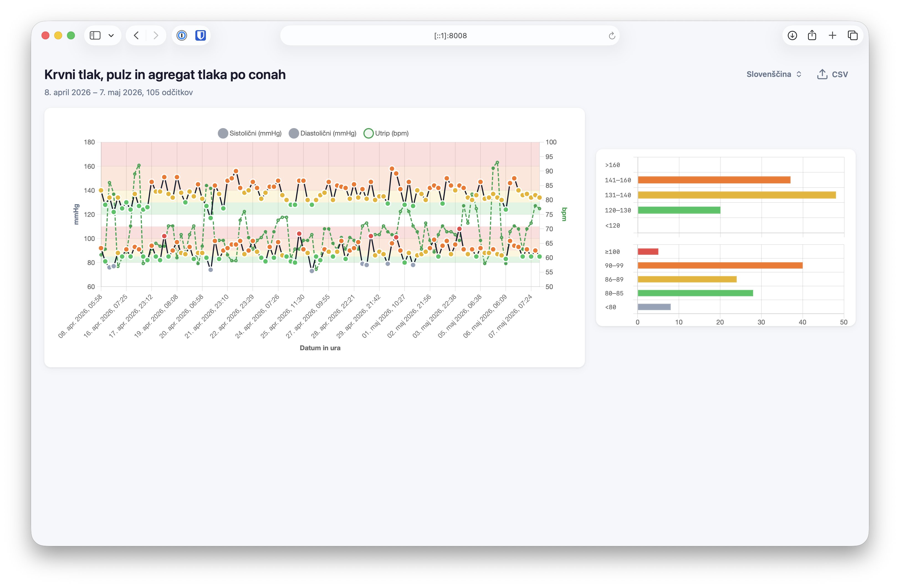

# Blood pressure chart (CSV)

Single-page web app that turns a blood pressure export CSV into charts you can explore in the browser. It is aimed at files such as those exported from **Omron Connect** and similar devices or apps that use a compatible column layout.

## Features

- **Line chart** of readings over time: systolic and diastolic pressure (dual scale, mmHg) and pulse (bpm), with shaded target zones and colour cues for each measurement.
- **Summary bar charts** that aggregate how many readings fall into each pressure zone (separately for systolic and diastolic), so you can see patterns at a glance.
- **CSV import** via a small in-page dialog; the main view stays focused on the charts once data is loaded.
- **Many languages**: the interface is available in all official EU languages, plus Japanese, Norwegian, and Ukrainian. **The language is chosen automatically** from your browser settings when possible; you can still switch it manually from the language menu in the header.
- **Translations are not professionally verified.** If you spot errors or awkward wording, **pull requests are very welcome**—small fixes are especially helpful.

> Screenshot of the app. Data for the chart is random generated. See source file `sample-data.csv` in this repository.

## Usage

1. Open the app.
  - The app is available online at: [markodvornik.github.io/omron-charts](https://markodvornik.github.io/omron-charts/).
  - To use it offline download `index.html` file on your computer and open it in a modern desktop or mobile browser (the page loads Chart.js from a CDN, so an internet connection is required on first load).
2. Use the **CSV** control to open the import panel, choose your export file, then **load** it. Expected columns (header row) include: `Date`, `Time`, `Systolic (mmHg)`, `Diastolic (mmHg)`, and `Pulse (bpm)`. The expected separator in the template is a **semicolon (`;`)**; other common delimiters may be detected when the header clearly matches.
3. If something is wrong with the file (missing columns, bad dates, empty file), the app shows a short error message keyed to the current language.
4. Use your **browser zoom** or window width if you need larger text or a wider chart area; the layout is responsive.

### Export for print

For a **reliable printout**, the most dependable workflow is:

1. Use the browser’s **Print** dialog, but destination **Save as PDF** (or “Export to PDF”), and review the PDF preview.
2. **Print from the PDF** (or share the PDF) rather than relying on a direct “Print” of the live HTML page.

Because the layout is responsive and depends on the live browser chrome, **printing straight from the HTML page can sometimes produce awkward page breaks or scaling**. Exporting to PDF first lets you confirm exactly what will be on paper.

## Privacy and legal

- **The app runs entirely in your browser.** Your CSV is read and processed locally (JavaScript on the page). **No readings or personal health data are sent to the authors** or to any backend operated by this project.
- **Hosting** (if you serve this file from a web server) may still create **ordinary server logs** (for example URL access, timestamps, or IP addresses, depending on the provider). That is outside the control of this HTML file; check your host’s privacy notice if you publish it.

**Disclaimer:** This tool is provided for convenience and visualisation only. It is not medical advice. The authors and contributors **are not liable** for any misuse, misinterpretation, or decision made on the basis of these charts. **Any contribution or modification is free and welcome** under the terms of the license of this repository.
